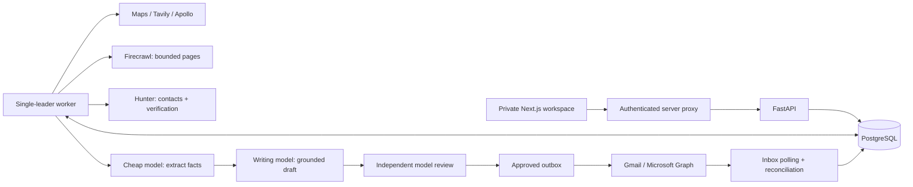
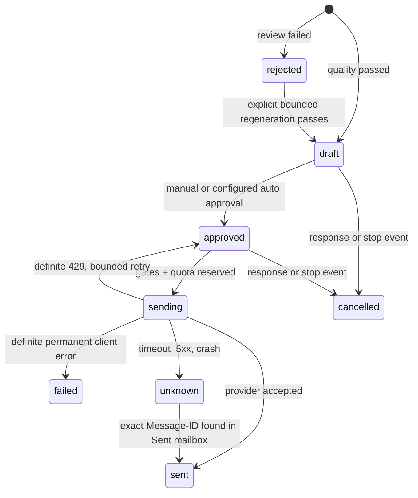

> Historical MVP description. The authoritative Module 1 design is [../ARCHITECTURE.md](../ARCHITECTURE.md); deployment requires [MIGRATION_PLAN.md](MIGRATION_PLAN.md).

# Architecture

## Ownership and execution

The browser never receives provider keys. Next.js gates the workspace with authentication, checks mutation origins, and forwards to FastAPI using a server-only bearer key. FastAPI validates requests and queues work. Paid provider calls and all sends execute in the worker, serialized by a PostgreSQL session-level advisory lock. Queue rows persist across restarts; jobs with interrupted external work require inspection and explicit retries. SQLite is a convenience for one-machine development, with a local OS worker lock; PostgreSQL is required in production.

No Redis is needed at this scale. The target throughput is 20–30 messages per day, so serialization simplifies cost and send-limit correctness. Multiple worker replicas compete for one lock; only the leader performs a tick. Do not split sending into a second independent process that bypasses the leader.

## Data model

| Table | Purpose / constraints |
|---|---|
| profiles | Single student at id=1; JSON resume, links, projects, awards, skills, interests, snippets, background; verified flag |
| companies | Unique normalized domain, website/source, optional distance, research JSON, score and individual factors, CRM stage, demo marker |
| evidence | Company FK, exact quote, source URL, extracted fact, category and retrieval time |
| contacts | Company FK, globally unique normalized email, name/title/source, validation result and time |
| outreach | Company/contact FKs; unique company + sequence (0–3), body, subject, evidence IDs, review, profile hash, delivery identifiers, due/send timestamps |
| events | Company FK; unique provider/manual source ID prevents duplicate inbox events; outcome / draft revision audit |
| suppressions | Email primary key; bounce, opt-out, negative reason; checked at send time |
| jobs | Durable operation, input, unique dedupe key, state, timestamps, sanitized errors and results |
| usage | Service, company, reserved USD, actual returned token count, timestamp |
| cache | Hashed URL/query key, serialized result and expiry |
| state | Automation configuration, mailbox cursor and worker heartbeat |

The initial migration is frozen in `migration_v1.py`. `SCHEMA.sql` is generated with the PostgreSQL dialect from that schema. Add explicit Alembic migrations for future changes; do not edit migration v1 after deployment.

## Research budget and stopping

- One discovery job has a 60-second wall-clock deadline, one search request, max 50 candidates, no recursive region scans. Default target is 30; providers can return fewer. Identical requests are cached 14 days.
- Homepage first; then `/about`, `/careers`, `/contact`, optional `/blog` and `/news`, within the configured 1–10 page ceiling (the current conventional-path plan contains six URLs). No whole-site crawling.
- At most 120 seconds per company by default, hard configurable maximum 300. Each network call has its own timeout.
- Fact extraction runs after the homepage and selected checkpoints. Stop when description, contact, and two exact-source-backed facts exist. Otherwise finish the bounded page plan or record a block.
- Premium models receive compact evidence and profile JSON, never entire website dumps. The extractor receives at most 9,000 characters per fetched page.
- Two drafts maximum per generation job, each independently reviewed. Maximum seven LLM calls per company in a rolling 24-hour window. An explicit user regeneration shares this limit.
- Daily and per-company cost reservations are written **before** external requests. Failed calls retain reservations. Model outputs are bounded to 1,800 tokens. Conservative reservation amounts must be tuned to current provider charges; API spend ceilings remain the actual financial backstop.

## Scoring

Weights sum to 100: proximity 15, size 10, response likelihood heuristic 10 (currently awards 8 for available contact or 2 otherwise), startup friendliness 10, internship history 15, technology alignment 20, student friendliness 10, contact availability 10. This is a prioritization heuristic, not a calibrated probability. Missing distance gets zero proximity credit. Internship history requires explicit extracted evidence. Student friendliness does not mean confirmed legal eligibility or an open position. Use the source brief to verify eligibility with the team.

## Message state machine

Daily cap includes initial emails, follow-ups and uncertain attempts. A stable RFC Message-ID identifies each outreach record. The minimum interval is 120 seconds; at most 30 per day. There is no claim of exactly-once delivery across an external API: uncertain state is quarantined rather than retried. The mailbox sync runs immediately before every send. New matched replies, including automatic replies, conservatively stop pending outreach. An opt-out/bounce/negative outcome additionally suppresses the address. Fresh Hunter validation is required within seven days. Catch-all / risky results cannot send.

Profile changes invalidate approvals and a hash comparison at send time catches stale content. Demo records cannot pass the delivery gate even if manually altered to approved. HTML from websites is not rendered in the interface and research is treated as untrusted data in prompts. Source quotes must be exact substrings of fetched content, and the independent model checks paraphrase entailment. This reduces, but cannot eliminate, hallucinations.

## Follow-ups and learning

Sequences 1–3 become eligible on days 7, 14, 30 after the initial message. Each requires its predecessor to be confirmed sent and at least six days since that predecessor; a long outage never produces a same-day catch-up burst. The model sees prior emails and must add a different useful proposal. Reply/interview/offer/negative/closed events stop automation for that company.

Metrics use distinct real companies with an initial sent email as the denominator; follow-ups do not inflate send cohorts. Industry/strategy patterns report sample sizes and smoothed rates, with fewer than ten samples marked exploratory. This evidence feeds future generation; it does not modify prompts unsupervised or assert causal response improvements. Subject lines are retained for inspection. Opens are optional manually recorded observations, excluded from optimization.

## Operational limits

Single user, one mailbox, no file uploads (paste resume text), no attachment parsing, no multi-tenant isolation, no payment system, no provider webhooks. No arbitrary shell tools or agent browsing beyond fixed provider APIs. The worker logs identifiers and exception types, not secrets or raw email bodies. Database contains personal data: restrict access, encrypt storage, and back up privately.
